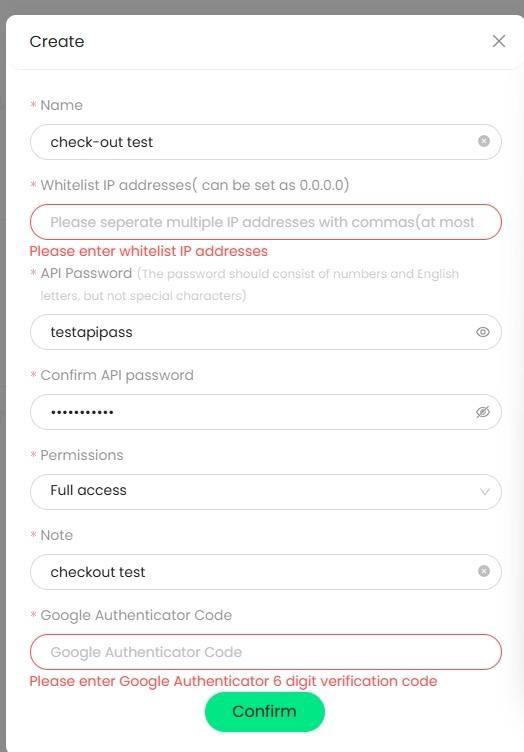
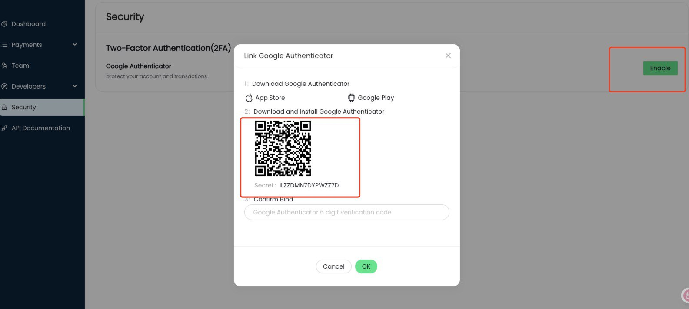

# PayCrypto-Checkout API Documentation


[PayCrypto](https://paycrypto.com/) is a leading cryptocurrency service provider in the industry, supporting various businesses such as cryptocurrency payment acceptance, card issuance, and corporate cards. This document provides API services specifically for the cryptocurrency payment acceptance business to meet the payment needs of merchants.

We provides a collection of APIs that enable you to process and manage payments. Our APIs accept and return JSON in the HTTP body, and return standard [HTTP response codes](https://en.wikipedia.org/wiki/List_of_HTTP_status_codes). You can consume the APIs directly using your favorite HTTP/REST library. We have a testing environment called sandbox, which you can [sign up](https://merchants-sandbox.paycrypto.com/) for to test API calls without affecting live data.


* [Integration Steps](#Integration-Steps)
* [API Documentation](#API-Documentation)
    * [POST Create Payment Order](#POST-Create-Payment-Order)
    * [GET Query Order Record by Order Number](#GET-Query-Order-Record-by-Order-Number)
    * [GET Query Order Records](#GET-Query-Order-Records)
    * [GET Query the order amount threshold](#GET-Query-the-order-amount-threshold)
    * [Webhook](#Webhook-Order-Status-Push)
    * [POST Test Webhook](#POST-Test-Webhook)
* [Error Codes](#Error-Codes)
* [FAQ (Frequently Asked Questions)](#FAQ-Frequently-Asked-Questions)

## Integration Steps

1. Register as a merchant in the [merchant backend](https://merchants-sandbox.paycrypto.com/) and wait for PayCrypto's review. Merchants can login successfully only after PayCrypto approves the review.

2. After logging in, merchants can enter the [Developers - API keys menu](https://merchants-sandbox.paycrypto.com/) to create an API Key and Secret. Developers of merchants can refer to the sample code and call PayCrypto's API service to create payment orders.

3. Webhooks API allows to receive real-time events. Merchants can access the [Developers - Webhooks menu](https://merchants-sandbox.paycrypto.com/), where they can choose to configure Webhook callbacks. Any changes in the order status will be notified to the merchant's service via the callback URL.


**Merchant backend**：

Sandbox environment：[https://merchants-sandbox.paycrypto.com](https://merchants-sandbox.paycrypto.com)

Live environment：[https://merchants.paycrypto.com](https://merchants.paycrypto.com)

**API service**：

Sandbox environment：[https://payapi-sandbox.paycrypto.com](https://payapi-sandbox.paycrypto.com)

Live environment：[https://payapi.paycrypto.com](https://payapi.paycrypto.com)


### Back-end SDKs
Our back-end SDKs allow you to process payments securely, without having to handle sensitive data. We offer SDKs for the following languages:

**Java** code sample: [https://github.com/inst-money/inst-java-sdk](https://github.com/inst-money/inst-java-sdk)

**PHP** code sample: [https://github.com/inst-money/inst-sdk-php](https://github.com/inst-money/inst-sdk-php)

**Javascript** code sample: [https://github.com/inst-money/inst-sdk-js](https://github.com/inst-money/inst-sdk-js)

```java
  String host = "https://payapi-sandbox.paycrypto.com";
  String apiKey = "";
  String apiSecret = "";
  String apiPassphrase = "";
  HttpUtil.init(host,apiKey,apiSecret,apiPassphrase);
  String requestPath = "/api/v1/payment";
  String requestQueryStr = "";
  PaymentReq req = new PaymentReq();
  req.setCurrency("USD");
  req.setAmount("1.3");
  req.setCust_order_id(UUID.randomUUID().toString());
  req.setReturn_url("https://sandbox.yourhost.com/status.html");
  ......
  HttpUtil.post(requestPath,requestQueryStr,req.toString());
{
  "code": 0,
  "msg": "SUCCESS",
  "result": {
    "order_id": "p25041408020716468",
    "redirect_url": "https://pay-sandbox.paycrypto.com/?id=p25041408020716468",
    "create_time": 1744617727892
  }
}

```


## Integrate with REST API

### API Specifications

* API requests use HMAC authentication.

* Pagination - Query record lists are all divided into pages, Pagination parameters: page_num represents the page number, page_size represents the size of each page. API DTO uniformly returns total, records.

* Country - Two digit country codes, refer to ISO 3166-1 alpha-2 standards.

* Time management - API requests and responses return a UNIX timestamp, unit being seconds, in order to avoid issues due to regional time differences.

* Amount management - All API requests and responses are of the string data type in order to avoid precision loss.

* All the requests that have a body but don't explicitly define a format are of JSON type, Content-Type: application/json

* The query interval of all query interfaces must be less than one month

* API response format standard


| Parameter	| Type |	Description |
| :---------: | :----:   | :--------------------------- |
|code	|int	| Error code. 0: Normal, non-0: Abnormal |
|msg	| string	| SUCCESS indicates success, error code indicates and describes failure |
| result |	object |	Result |


### HMAC Authentication
The merchant first needs to apply for the API key and API secret that will be used when accessing the API.

| Term | 	Description |
| :---------: | :----:   | 
| API Key & API Secret | 	Multiple API key + API secret maintained under a User ID, API key is linked with an application, multiple applications are allowed, each application can apply for API access privileges |

### Client side implementation process:
1. Compose the data that needs to be signed, including-

   * UNIX timestamp, unit being milliseconds: the request time stamp

   *  Request method: HTTP method

   * Request API key： API Key

   * Complete request path, including the URL parameters: request URI

   * If there is a request body, the post conversion string of the body also needs to be added: string representation of the request payload

2. Client side generates the signature using HMAC_SHA256 based on the data and API secret

3. Set the Authorization header based on the fixed sequence, i.e. the key is Authorization, and the value is: Inst:ApiKey:request time stamp:signature (linked using colon)

4. If the server side sets a password when creating the API key and secret, then an Access-Passphrase header needs to be set, i.e., the key is Access-Passphrase, and the value is the password.

5. Client side sends the data, Authorization header, and the Access-Passphrase header (in case there is a fourth step) to the server side, i.e., the final http header sent is as follows:

```
    Authorization：Inst:ApiKey:request timestamp:signature

    Access-Passphrase：Your API Secret passphrase
```


### How to build the request body string to be signed:

The parameter names of the request body need to be based on the respective ASCII values, pair key and value using =, and connect multiple key-value pairs using & to form a string.

Here is an example body-

```json
{
    "from_address":"0xef678007D18427E6022059Dbc264f27507CD1ffC",
    "amount":190,
    "to_address":"0x430F048fE0A1798be43e0C57207E9b239EcC429B"
}
The payload is converted to:

amount=190&from_address=0xef678007D18427E6022059Dbc264f27507CD1ffC&to_address=0x430F048fE0A1798be43e0C57207E9b239EcC429B


example:


request body: {amount=10, currency=USD, cust_order_id=1185a4d49e1c, customer={"zipcode":"24000","country":"USA","address":"sgasgs,shfojsg,AA","city":"B","phone":"+12123434235","last_name":"Li","state":"A","first_name":"Jack","email":"josh_chow6@qq.com"}, return_url=https://docs.google.com/}

origin sign data: 1646279846494POSTddb2e451f9534b61a3476f6f4316087e/api/v1/paymentamount=10¤cy=USD&cust_order_id=1185a4d49e1c&customer={"address":"sgasgs,shfojsg,AA","city":"B","country":"USA","email":"josh_chow6@qq.com","first_name":"Jack","last_name":"Li","phone":"+12123434235","state":"A","zipcode":"24000"}&return_url=https://docs.google.com/

https://payapi-sandbox.paycrypto.com/api/v1/payment
Authorization:Inst:apiKey:1646279846494:signature
Access-Passphrase:12345678a

response: {
    "code":0,
    "msg":"SUCCESS",
    "result":{
        "order_id":"p2203030311822",
        "redirect_url":"https://{url}/?id=p2203030311822",
        "create_time":1646279848594
    }
}


```


## Error Codes

### Business Logic Error Codes


| Status Code |	Description |
| :---------: | :----:   | 
|0	|Succesful|
|111001	|Request parameter error|
|111002	|This currency is not supported.|
|111003	|This order does not exist.|
|111004	|The time format is incorrect.|
|111015	|There is an exception in the push communication.|

### Identity Authentication Error Codes


|Status Code	|Description|
| :---------: | :----:   | 
|112001	|Request timed out|
|112002	|Illegal access privileges|
|112003	|Invalid IP address|
|112004	|Invalid timestamp|
|112005	|Verification failure|
|112006	|Invalid verification format|
|112007	|Invalid signature|
|112008	|Specified app key not found|
|112009	|Invalid app key secret|
|112010	|Invalid request header|


### Abnormal Status Error Codes

|Status Code	|Description|
| :---------: | :----:   | 
|119001	|Service unusable|
|119002	|Communication error|
|119003	|Data encryption error|
|119004	|Data decryption error|
|119005	|Too many API requests|
|119006	|Unauthorized API|
|119007	|Public key format error|

## API Documentation

### POST Create Payment Order

The checkout API service will return the payment URL. When a payment is made at the payment URL, the payment result will be redirected to the return_urls address. For example, return_url?id=2021031609283339501898843&status={0. In - progress, 1. Payment successful, 2. Confirming, 3. Abnormal, 4. Failed, 5. Cancelled, 6. Order expired, 7. Refunding, 8. Refund successful, 9. Refund failed}


```
https://payapi-sandbox.paycrypto.com/api/v1/payment

```

Request：

|Parameter|	Type	|Whether Required	|Description|
| :---------: | :----:   | :--------------------------- | :--------------------------- |
|currency|	String	|Required|	Currency, For example: USD,USDT,USDT-BEP20,USDT-TRC20,USDT-SPL|
|amount       |	 String	|Required	| Order amount|
|cust_order_id |	String | Required | Merchant order number  |
|return_url|	String	|Optional|	After the order is completed, whether successful or failed, the user will be redirected to this URL.|
|notify_url|	String	|Optional|	Webhook URL. we will push order status changes to you.|
|company_name|	String	|Optional|	The company name shown to users on the payment page.|
|company_email |String|Optional| The company email for receive payment receipt |
|expire|	long|	Optional|	Expiration time, in milliseconds. It is recommended not to fill it in. If not filled, it will expire 100 minutes after the start of payment by default.|
|customer|	Object|	Optional|	Customer infomation|

Customer：

|Parameter| 	Type	  |Whether Required	|Description|
| :---------: |:-------:| :--------------------------- | :-------------------------- |
|customer.notify_email | 	String |	Optional|	When the order status changes, customers will be notified by Paycrypto via email.|


Response：

|Parameter|	Type|	Description|
| :---------: | :----:   | :--------------------------- | 
|order_id|	String|	Order number|
|redirect_url	|String	|Payment link|
|create_time|	String	|Creation time|

```json

HEADERS

Content-Type:application/json
Authorization:Inst:ApiKey:request timestamp:signature
Access-Passphrase:Your API Secret passphrase

Request: {
    "currency": "USD",
    "amount": "100.05",
    "cust_order_id": "1223",
    "return_url": "https://{yourhost}/index.html",
    "expire":1739356323022,
    "customer":{
        "notify_email":"jack001@163.com"
    }
}

Response: {
    "code": 0
    "msg": "SUCCESS",
    "result": {
        "order_id": "2021031609283339501898843",
        "redirect_url": "https://pay-sandbox.paycrypto.com/?id=il25050709552116315",
        "create_time": 1585293811000
    }
}


```


### GET Query Order Record by Order Number

Query a single order record

```
https://payapi-sandbox.paycrypto.com/api/v1/orders

```

Request：

|Parameter|	Type|	Whether Required|	Description|
| :---------: | :----:   | :--------------------------- | :--------------------------- |
|order_id|	String|	Optional|	Checkout order number|
|cust_order_id|	String	|Optional	|Merchant order number|


Response：

|Parameter	|Type	|Description|
| :---------: | :----:   | :--------------------------- | 
|currency|	String|	Currency|
|amount|	String	|Order Amount|
|paid_currency	|String|	User payment currency|
|paid_amount	|String	|User payment amount|
|cust_order_id	|String	|Merchant order number|
|order_id|	String	|Checkout order number|
|status|	String	| Order status. 0. In processing, 1. Success, 2. Confirming, 3. Abnormal, 4. Failed, 5. Cancelled, 6. Order expired, 7. Refunding, 8. Refund successful, 9. Refund failed|
|currency_rate|	String|	Currency rate|
|reason|	String	|Reasons for success, failure, etc.|
|create_time|	String|	Creation time|
|update_time|	String	|Update time|


```json
HEADERS

Content-Type:application/json
Authorization:Inst:ApiKey:request timestamp:signature
Access-Passphrase:Your API Secret passphrase

Request: &cust_order_id=2021031609283339501898843  or &order_id=p22032307232449

Response: {
    "code": 0,
    "msg": "SUCCESS",
    "result": {
        "code": 0,
        "msg": "SUCCESS",
        "result": {
            "page_num": 1,
            "page_size": 10,
            "total": 1,
            "pages": 1,
            "records": [
                {
                    "currency": "USD",
                    "amount": "13.2",
                    "paid_currency": "",
                    "paid_amount": "0",
                    "order_id": "20210716080455300000193",
                    "cust_order_id": "1ec7b32b-0750-4308-b882-f00d45b4f712",
                    "currency_rate":"0",
                    "reason":"Approved",
                    "status": 0,
                    "create_time": 1626418074000,
                    "update_time": 1626418074000
                }
            ]
        }
    }
}

```


### GET Query Order Records

Query order records by pagination

```
https://payapi-sandbox.paycrypto.com/api/v1/orders?currency=usd&start_timestamp=1585293811000&end_timestamp=1585293812333&page_num=1&page_size=10
```


Request：

|Parameter|	Type|	Whether Required|	Description|
| :---------: | :----:   | :--------------------------- | :--------------------------- |
|currency	|String	|Optional|	Currency|
|start_time	|String|	Optional|	Start time, in the form of a timestamp, such as 1626339331000|
|end_time|	String|	Optional|	End time, in the form of a timestamp, such as 1626339331000. By default, it is the current time.|
|page_num	|String|	Optional|	Which page, with the default being the first page|
|page_size|	String|	Optional|	Number of items per page. The default size is 10.|
|status	|String	|Optional	|Order status|

Response：

|Parameter|	Type	|Description|
| :---------: | :----:   | :--------------------------- | 
|currency	|String|	Currency|
|amount	|String|	Order amount|
|paid_currency|	String|	User payment currency|
|paid_amount|	String	|User payment amount|
|cust_order_id	|String	|Merchant order number|
|order_id	|String	|Checkout order number
|status	|String|	Order status. 0. In processing, 1. Success, 2. Confirming, 3. Abnormal, 4. Failed, 5. Cancelled, 6. Order expired, 7. Refunding, 8. Refund successful, 9. Refund failed|
|currency_rate	|String	|Currency rate|
|reason	|String	|Reasons for success, failure, etc.|
|create_time	|String|	Creation time|
|update_time|	String	｜ Update time|


```json


Request: currency=usd&start_timestamp=1585293811000&end_timestamp=1585293812333&page=1&page_size=10


Response: {
    "code": 0,
    "msg": "SUCCESS",
    "result": {
        "page_num": 2,
        "page_size": 20,
        "total": 22,
        "pages": 2,
        "records": [
            {
                "currency": "USD",
                "amount": "1",
                "paid_currency": "USDT",
                "paid_amount": "0",
                "order_id": "20210716080455300000193",
                "cust_order_id": "4e2ee23c-6521-41b6-9203-16cecf9dac48",
                "status": 0,
                "reason":"Approved",
                "create_time": 1626339048000,
                "update_time": 1626339048000
            },
            {
                "currency": "USD",
                "amount": "2",
                "paid_currency": "",
                "paid_amount": "0",
                "order_id": "20210716080455300000111",
                "cust_order_id": "976e79b5-5c52-45a6-ac2b-cfee58894866",
                "reason":"Approved",
                "status": 1,
                "create_time": 1626314595000,
                "update_time": 1626320164000
            }
        ]
    }
}


```


### GET Query the order amount threshold

Query the order amount threshold

```
https://payapi-sandbox.paycrypto.com/api/v1/merchant/limit

```


Response：

| Parameter	| Type| 	Description| 
| :---------: | :----:   | :--------------------------- | 
| cust_name| 	String| 	Merchant name| 
| min_limt| 	long | 	The minimum amount of the payment order must be greater than this amount.| 
| max_limit| 	long	| The maximum amount of the payment order must be less than this amount.| 
| fiat_list| 	Array| 	Currency| 

```json

Response: {
	"code": 0,
	"msg": "SUCCESS",
	"result": {
		"cust_name": "Surfshark Limited",
		"min_limit": 1.000000,
		"max_limit": 10.000000,
		"fiat_list": ["USD"]
	}
}

```


###  Webhook

Please first configure the correct Webhook callback address in the merchant backend; otherwise, you won't be able to receive the data. When a push is received, parse the Header for signature verification. The push request header contains two fields for security authentication:

```
https://{merchant's host}/callback
```

| Header | 	Type| 	Description| 
| :---------: | :----:   | :--------------------------- | 
| Signature	| String |	The signature| 
| Timestamp	| String |	The timestamp| 

To improve efficiency, for the same type of Action, we will push multiple events in batches. The data structure of the pushed event Body is as follows:

| Parameter	| Type	| Description| 
| :---------: | :----:   | :--------------------------- | 
| action	| String| 	Push type, e.g., order_result (order result)| 
| events	| String[]	| Array of pushed messages| 
| events[n].params	| Object| 	The content of the messages pushed this time, presented as a JSON object| 
| events[n].id	| String	| The unique push identifier| 
| events[n].create_time| 	long	| The time when the event occurs, with the default being UTC time.| 


After the institution receives the push, the data structure of the response for all Actions is the same. As long as the format returned by the institution is correct, regardless of the code value, we will no longer push this event. The return format is as follows:

| Parameter	| Type| 	Description| 
| :---------: | :----:   | :--------------------------- | 
| code	| int| 	0: success, other: failure| 
| msg	| String| 	Description of error code| 


The request parameters for pushing the order_result Action are:

| Parameter	| Type	| Whether Required	| Description| 
| :---------: | :----:   | :--------------------------- | :--------------------------- |
| action| 	String| 	Required| 	order_result| 
| events	| String[]| 	Required	| The array of pushed messages| 
| events[n].params.order_id	| String| 	Required| 	Checkout order number| 
|  status | int| 	Required| 	Order status：0.pending 1.success 2.comfirming 3.invalid/exception 4.fail 5.canceled 6.order expire 7. refunding 8.refund success 9.refund fail| 


```json

Order status push:
{
    "action": "order_result",
    "events": [
        "{\"id\":\"bc76488ddda4\",\"create_time\":1585293811000,\"params\":{\"order_id\":\"1234\",\"cust_order_id\":\"123\",\"status\":1}}"
    ]
}
In one Action, multiple events can be included. The elements in the events array need to be converted from string to JSON, for example: 
{
    "id": "bc76488ddda4",
    "create_time": 1585293811000,
    "params": {
        "order_id": "1234",
        "cust_order_id": "123",
        "status": 1,
        "reason": ""
    }
}

Response format：
{
    "code": 0,
    "msg": "SUCCESS"
}


```


### POST Test Webhook

This interface is used to verify whether the callback function is working properly. After you call this interface, we will send a test data to your callback address within 10 seconds.

```
https://payapi-sandbox.paycrypto.com/api/v1/events/test
```


```json
Request: {}


The pushed message Request: {
    "action": "order_result",
    "events": [
        "{\"id\":\"bc76488ddda4\",\"create_time\":1585293811000,\"params\":{\"order_id\":\"123\",\"cust_order_id\":\"123\",\"status\":1}}"
    ]
}


Response: {
    "code": 0,
    "msg": "SUCCESS"
}

```


# FAQ Frequently Asked Questions


### Please unlock my merchant account email by demo@gmail.com ？

approved in Sandbox. 

Sandbox: https://merchants-sandbox.paycrypto.com/user/login

approved in Live.

Live: https://merchants.paycrypto.com/user/login


### Current testing procedure:

1. Create a payment order and receive the 'redirect_url' through API.
2. Open the redirect_url in your store, and don't use your real card.
3. Contact us, and we will manually edit the order status to either "success" or "failure".
4. Pls refresh the redirect_url page, and it will redirect to your store in few seconds.


We set up the test transaction. Please provide us the test card?

At the moment, the sandbox environment does not support test cards and only allows manual changes to the order status—either to success or failure.


### integrate our SDK

I'm new about SDKs then discuss about it with my IT guy. It looks other php or js we must create between cgi and payment api?

Yes. Your IT guy integrate our SDK code that include payment api into your CGI program. Just refer to the SDK and modify the api credentials to your


My IT guy tested sdk then error returned as 

code:　112008
msg:　app key invalid

He asks why. Please let me know.

Please send me your code so that I can help you confirm it. Thanks. pls send us your program code (I guess you use PHP ).


### How to create API key?



please enable google authenticate.



### A question about api get url. What should I put as {{host}} in this example? And I guess it must be https.

https://{{host}}/api/v1/orders?currency=usd&start_timestamp=1585293811000&end_timestamp=1585293812333


API service(host)：

Sandbox environment：https://payapi-sandbox.paycrypto.com

Live environment：https://payapi.paycrypto.com

The API service cannot be opened directly using a browser. After your engineers use PHP code to create an order, the order payment link can be opened using a browser, such as: https://pay-sandbox.paycrypto.com/?id=hm25042906295927997


### How create payment order?

Please refer to our Backend SDKs.

For create payment order pls use POST - Payment Acceptance - Create Payment Order
Response: 
```
{ 
  "code": 0, 
  "msg": "SUCCESS", 
  "result": { 
   "order_id": "2021031609283339501898843",    
   "redirect_url": "https://pay-sandbox.paycrypto.com/?id=hm25042906295927997", 
   "create_time": 1585293811000 
 } 
}
```

In response data, parameter 'redirect_url' is the order payment URL.


The checkout API service will return the payment URL. When a payment is made at the payment URL, the payment result will be redirected to the return_urls address. For example, return_url?id=2021031609283339501898843&status={0. In - progress, 1. Payment successful, 2. Confirming, 3. Abnormal, 4. Failed, 5. Cancelled, 6. Order expired, 7. Refunding, 8. Refund successful, 9. Refund failed}


### How to create by GET url with parameters?


Our cgi uses GET method, then I take a look GET part. Only php/ Js can make sandbox?  GET Payment Acceptance - Query Order Record by Order Number
https://payapi-sandbox.paycrypto.com/api/v1/orders Query a single order record

Please refer to our Backend SDKs.


### what is this?  Access-Passphrase: {Your API Secret passphrase}
The API key password you created in https://merchants-sandbox.paycrypto.com/


name= anything, whitelist IP= IP of our host server. API password= something ecrypto like but it will show online in POST.  right?

Not show online, It is saved in your backend.


###  return_url is our website url after complete the payment? 
YES


### I can find now. Should I leave webhook? Or create both?
It’s better to complete the API call first, then create the webhook

And how to add more webhooks for the other website?

We support specifying the notify URL when creating a payment order. 


### if I send the testcart url, can you test processing for example?

If you’ve already integrated our Sandbox, I can help run tests using your testcart URL.


For webhook : https://www.***.com/movie/shopcart/Z_test/test_success.cgi

We POST: 
{"cust_order_id":"1_1746926531","order_id":"p25051101221118256","status":1}

Pls Response in json:

```
{
    "code": 0,
    "msg": "SUCCESS"
}
```


If your Sandbox environment has been successfully validated, you can also try real card payments in the Live environment.


### On the api docs, there are parameters 0-6 I guess, only success parameter will be back?
Currently, you only need to take care of the successful status, which should be enough for now.

### Even different website, payment goes to same company name screen?
 You can specify the company name 'company_name' when creating an order.

### When the payment succeeded, just webfook kick the url? No parameters be back ?
Here are our webhook parameters:
``` 
{
    "id": "bc76488ddda4",
    "create_time": 1585293811000,
    "params": {
        "order_id": "1234",
        "cust_order_id": "123",
        "status": 1,
        "reason": ""
    }
}
```


### And now this is manipulation,  when the real transaction is working,  this notification push webhook automatically?

The notification push webhook automatically. If communication fails we try 5 times in total.


### Then we'll install the other sites. Please add other webhooks at that time?
Since you operate multiple sites, please fill different 'notify_url' values for each. We also recommend using unique order number prefixes to distinguish orders across sites.


### I need example. URL or anything string for notify_url?  if it is webhook url, we don't need to set the url in webhook in developper screen?
 we prioritize the notify_url. If notify_url is not provided, we will use the url in webhook in developper screen.

